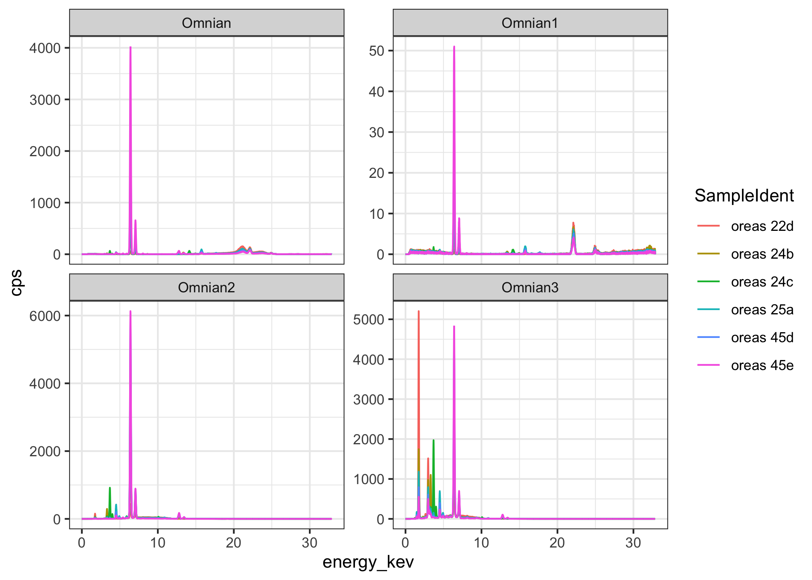
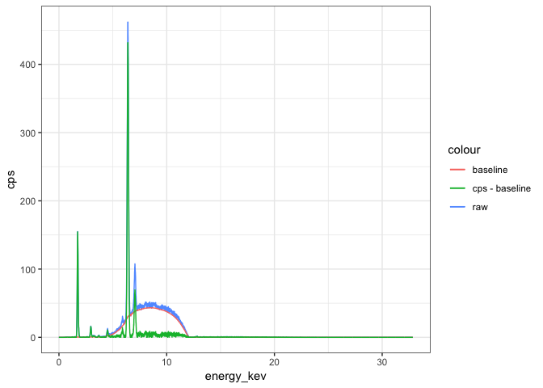
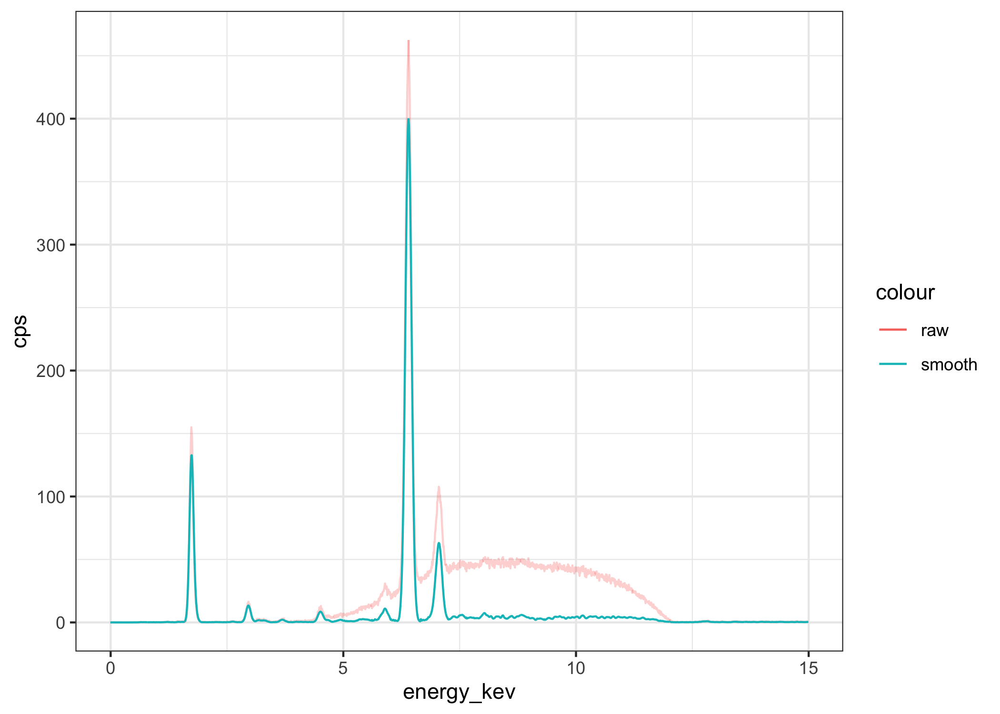
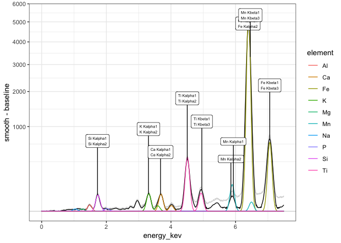
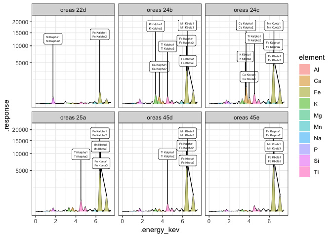

<!-- README.md is generated from README.Rmd. Please edit that file -->
xrf
===

[](https://travis-ci.org/paleolimbot/xrf) [](https://codecov.io/github/paleolimbot/xrf?branch=master)

The goal of xrf is to provide tools to read, plot, and interpret X-Ray fluorescence spectra.

Installation
------------

You can install xrf from github with:

``` r
# install.packages("devtools")
devtools::install_github("paleolimbot/xrf")
```

Example
-------

Read in a Panalytical XRF spectrum and plot it.

``` r
library(tidyverse)
library(xrf)
#> 
#> Attaching package: 'xrf'
#> The following object is masked from 'package:stats':
#> 
#>     filter

pan_example_dir <- system.file("spectra_files/Panalytical", package = "xrf")
pan_files <- list.files(pan_example_dir, ".mp2", full.names = TRUE)
specs <- read_xrf_panalytical(pan_files)
specs %>%
  xrf_despectra() %>%
  unnest(.spectra) %>%
  ggplot(aes(x = energy_kev, y = cps, col = SampleIdent)) +
  geom_line() +
  facet_wrap(vars(ConditionSet), scales = "free_y")
```



Baselines
---------

The **xrf** package can use several existing methods for estimating "background" or "baseline" values. The most useful of these for XRF spectra is the Sensitive Nonlinear Iterative Peak (SNIP) method, implemented in the **Peaks** package.

``` r
specs %>%
  slice(3) %>%
  xrf_add_baseline_snip(iterations = 20) %>%
  xrf_despectra() %>%
  unnest() %>%
  filter(energy_kev <= 15) %>%
  ggplot(aes(x = energy_kev)) +
  geom_line(aes(y = cps, col = "raw")) +
  geom_line(aes(y = baseline, col = "baseline")) +
  geom_line(aes(y = cps - baseline, col = "cps - baseline"))
#> Warning: package 'bindrcpp' was built under R version 3.4.4
```



Smoothing
---------

``` r
specs %>%
  slice(3) %>%
  xrf_add_baseline_snip(iterations = 20) %>%
  xrf_add_smooth_filter(filter = xrf_filter_gaussian(alpha = 2.5), .iter = 5) %>%
  xrf_despectra() %>%
  unnest() %>%
  filter(energy_kev <= 15) %>%
  ggplot(aes(x = energy_kev)) +
  geom_line(aes(y = cps, col = "raw"), alpha = 0.3) +
  geom_line(aes(y = smooth - baseline, col = "smooth"))
```



Deconvolution
-------------

``` r
deconvoluted <- specs %>%
  filter(ConditionSet %in% c("Omnian", "Omnian2")) %>%
  xrf_add_smooth_filter(filter = xrf_filter_gaussian(width = 5), .iter = 20) %>%
  xrf_add_baseline_snip(.values = .spectra$smooth, iterations = 20) %>%
  xrf_add_deconvolution_gls(
    .spectra$energy_kev, 
    .spectra$smooth - .spectra$baseline, 
    energy_max_kev = kV * 0.75, peaks = xrf_energies("major")
  )

certified_vals <- system.file("spectra_files/oreas_concentrations.csv", package = "xrf") %>%
  read_csv(col_types = cols(standard = col_character(), value = col_double(), .default = col_guess())) %>%
  filter(method == "4-Acid Digestion") %>%
  select(SampleIdent = standard, element, certified_value = value)

deconv <- deconvoluted %>% 
  unnest(.deconvolution_peaks) %>%
  select(SampleIdent, ConditionSet, kV, element, height, peak_area, peak_area_se)

deconv %>%
  left_join(certified_vals, by = c("SampleIdent", "element")) %>%
  ggplot(aes(x = certified_value, y = peak_area, col = SampleIdent, shape = ConditionSet)) +
  geom_errorbar(aes(ymin = peak_area - peak_area_se, ymax = peak_area + peak_area_se)) +
  geom_point() +
  facet_wrap(~element, scales = "free") +
  theme_bw(10)
#> Warning: Removed 22 rows containing missing values (geom_errorbar).
#> Warning: Removed 22 rows containing missing values (geom_point).
```



``` r
deconv_element <- deconvoluted %>%
  unnest(.deconvolution_components)

ggplot() +
  geom_line(
    aes(x = energy_kev, y = response), 
    data = deconvoluted %>% unnest(.deconvolution_response), 
    size = 0.2
  ) +
  geom_area(
    aes(x = energy_kev, y = response_fit, fill = element), 
    data = deconvoluted %>% unnest(.deconvolution_components), 
    alpha = 0.5
  ) +
  facet_wrap(~ConditionSet + SampleIdent, scales = "free") +
  scale_y_sqrt() +
  theme_bw(10)
#> Warning in self$trans$transform(x): NaNs produced
#> Warning: Transformation introduced infinite values in continuous y-axis
#> Warning: Removed 4504 rows containing missing values (position_stack).
```



``` r
spec <- specs %>%
  slice(7) %>%
  xrf_add_baseline_snip(iterations = 20) %>%
  xrf_add_smooth_filter(filter = xrf_filter_gaussian(alpha = 2.5), .iter = 5) %>%
  pull(.spectra) %>%
  first()

sigma_index <- 6
energy_kev <- spec$energy_kev
values <- spec$fit - spec$background
energy_res <- mean(diff(energy_kev))

search <- Peaks::SpectrumSearch(values, threshold = 0.01, sigma = sigma_index)

g <- function(x, mu = 0, sigma = 1, height = 1) height * exp(-0.5 * ((x - mu) / sigma) ^ 2)

tbl <- tibble::tibble(
  peak_index = search$pos,
  peak_energy_kev = energy_kev[peak_index], 
  peak_sigma = sigma_index * energy_res,
  peak_height = values[peak_index],
  peak_area = peak_height * peak_sigma * sqrt(2 * pi)
)

peak_response = pmap(list(mu = tbl$peak_energy_kev, sigma = tbl$peak_sigma, height = tbl$peak_height), g, energy_kev)
spec$deconv <- do.call(cbind, peak_response) %>%
  rowSums()
spec$deconv2 <- search$y

ggplot(spec, aes(energy_kev)) +
  geom_line(aes(y = fit - background, col = "original")) +
  geom_line(aes(y = deconv, col = "deconv")) +
  xlim(0, 10) +
  stat_xrf_peaks(aes(y = fit - background), epsilon = 10)
```

``` r
oreas22d <- specs %>%
  filter(SampleIdent == "oreas 22d") %>%
  unnest(.spectra) %>%
  mutate(cps = counts / LiveTime)

xrf_en <- x_ray_xrf_energies %>%
  crossing(tibble(ConditionSet = unique(oreas22d$ConditionSet))) %>%
  group_by(ConditionSet) %>%
  mutate(
    data = list(oreas22d[oreas22d$ConditionSet == ConditionSet[1],]),
    counts = approx(data[[1]]$energy_kev, data[[1]]$counts, energy_kev)$y,
    fit = approx(data[[1]]$energy_kev, data[[1]]$fit, energy_kev)$y,
    background = approx(data[[1]]$energy_kev, data[[1]]$background, energy_kev)$y,
    cps = approx(data[[1]]$energy_kev, data[[1]]$cps, energy_kev)$y
  ) %>%
  select(-data)

library(plotly)
plot_ly() %>%
  add_lines(x = ~energy_kev, y = ~cps, color = ~ConditionSet, hoverinfo = "none", 
            data = oreas22d) %>%
  add_markers(x = ~energy_kev, y = ~cps, text = ~element, color = ~ConditionSet, data = xrf_en)
```
